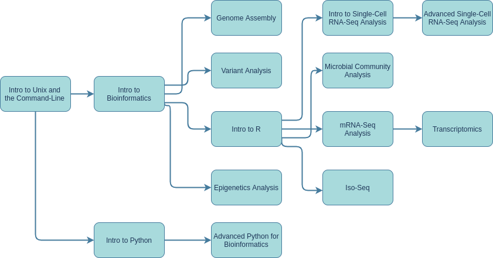

<html>
<body>
<!-- Image Map Generated by http://www.image-map.net/ -->

<map name="image-map">
    <area alt="Intro to Unix and the Command-Line" title="Intro to Unix and the Command-Line" href="intro_unix.html" coords="1,129,122,190" shape="rect">
    <area alt="Intro to Bioinformatics" title="Intro to Bioinformatics" href="intro_bioinfo.html" coords="159,131,282,190" shape="rect">
    <area alt="Intro to Python" title="Intro to Python" href="intro_python.html" coords="159,380,281,440" shape="rect">
    <area alt="Genome Assembly" title="Genome Assembly" href="assembly.html" coords="361,0,480,60" shape="rect">
    <area alt="Variant Analysis" title="Variant Analysis" href="variant.html" coords="360,90,481,150" shape="rect">
    <area alt="Intro to R" title="Intro to R" href="intro_r.html" coords="481,250,361,190" shape="rect">
    <area alt="Epigenetics Analysis" title="Epigenetics Analysis" href="epigenetics.html" coords="360,290,482,351" shape="rect">
    <area alt="Advanced Python" title="Advanced Python" href="adv_python.html" coords="359,381,482,440" shape="rect">
    <area alt="Iso-Seq" title="Iso-Seq" href="isoseq.html" coords="672,352,550,290" shape="rect">
    <area alt="mRNA-Seq Analysis" title="mRNA-Seq Analysis" href="mrna_seq.html" coords="550,189,671,251" shape="rect">
    <area alt="Microbial Community Analysis" title="Microbial Community Analysis" href="microbial.html" coords="551,90,670,151" shape="rect">
    <area alt="Intro to Single-Cell RNA-Seq Analysis" title="Intro to Single-Cell RNA-Seq Analysis" href="intro_scrna.html" coords="550,0,671,60" shape="rect">
    <area alt="Advanced Single-Cell RNA-Seq Analysis" title="Advanced Single-Cell RNA-Seq Analysis" href="adv_scrna.html" coords="721,1,841,60" shape="rect">
    <area alt="Transcriptomics" title="Transcriptomics" href="transcriptomics.html" coords="721,190,841,251" shape="rect">
</map>
</body>
</html>
